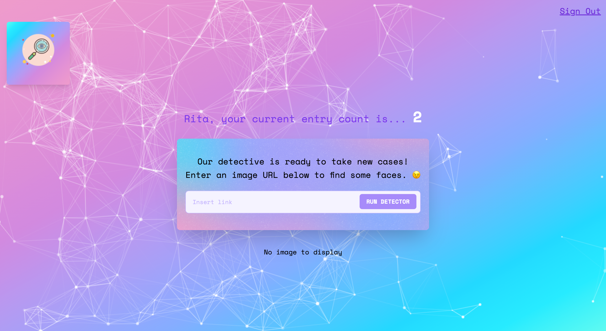

# Face Detective

Face Detective is a web application that allows users to detect faces in images using an AI-powered facial recognition API. This repository contains the frontend code for the application, which is built using React, Vite, and Tailwind CSS.



## Table of Contents

- [Getting Started](#getting-started)
- [Backend Repository](#backend-repository)
- [Installation](#installation)
- [Configuring Routes](#configuring-routes)
- [Running the Application](#running-the-application)
- [Submitting Issues](#submitting-issues)
- [Contributing](#contributing)
- [License](#license)

## Getting Started

To get started with the Face Detective frontend, please follow the installation and running instructions below.

## Backend Repository

This frontend application requires the Face Detective backend to function properly. You can find the backend repository and installation instructions at the following link:

[Face Detective Backend Repository](https://github.com/ritabradley/face-detective-backend)

Clone and follow the instructions in the backend repository README.md to set up and run the backend API.

## Installation

1. Clone the repository: 
``` bash 
git clone https://github.com/ritabradley/face-detective.git
```
2. Change to the project directory: 
```bash 
cd face-detective
```
3. Install the dependencies: 
```bash
npm install
``` 
or 
```bash
npm i
```

## Configuring Routes

To use the backend API running on your local machine, you need to update the routes in the frontend application. Find and replace any references to `https://face-detective-api.onrender.com/[some-route]` with `http://localhost:3000/[some-route]` in the frontend codebase. 

For example, in `App.jsx`, you'll want to change `https://face-detective-api.onrender.com/image` to `http://localhost:3000/image`. 

You'll find the other routes in `SignIn.jsx` and `Register.jsx`. Make the changes accordingly.

Save your changes.

## Running the Application

1. Run the development server: 
```bash
npm run dev`
2. Open your browser and navigate to `http://localhost:5173`.

## Submitting Issues

If you encounter any issues or bugs while using the Face Detective frontend, please create an issue on the GitHub repository. When submitting an issue, please follow these guidelines:

- Use a clear and descriptive title for the issue.
- Provide a step-by-step description of the issue and how to reproduce it.
- Include any relevant screenshots or error messages.
- Specify the version of Node.js and npm you are using, as well as your operating system and browser.

## Contributing

Contributions are welcome! Please follow these steps to contribute to the project:

1. Fork the repository.
2. Create a new branch with a descriptive name, e.g., `git checkout -b feature/face-detection-improvements`.
3. Make your changes and commit them with a clear and concise commit message.
4. Push your changes to the forked repository.
5. Create a pull request on the original repository and provide a description of the changes you made.

Please follow the code style and best practices of the project. Make sure to test your changes thoroughly before submitting a pull request.

## License

This project is licensed under the MIT License. Please see the [LICENSE](LICENSE) file for more information.


